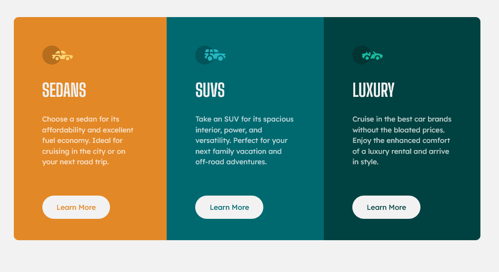
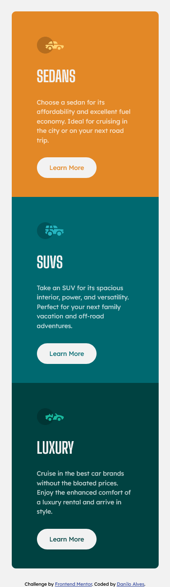

# Frontend Mentor - 3-column preview card component solution

This is a solution to the [3-column preview card component challenge on Frontend Mentor](https://www.frontendmentor.io/challenges/3column-preview-card-component-pH92eAR2-).

## Table of contents

- [Overview](#overview)
  - [The challenge](#the-challenge)
  - [Screenshot](#screenshot)
  - [Links](#links)
- [My process](#my-process)
  - [Built with](#built-with)
  - [What I learned](#what-i-learned)
  - [Continued development](#continued-development)
- [Author](#author)

## Overview

### The challenge

Users should be able to:

- View the optimal layout depending on their device's screen size
- See hover states for interactive elements

### Screenshot

<center>


<br/>
Desktop design


<br/>
Mobile design

</center>

### Links

- Solution URL: [Here!](https://github.com/mizek1/three-column-preview-card-component)
- Live Site URL: [Here!](https://mizek1.github.io/three-column-preview-card-component/)

## My process

### Built with

- Semantic HTML5 markup
- CSS custom properties
- Flexbox
- Responsive design with media query
- Mobile first

### What I learned

I'm very happy with this one! I tried to do mobile first and it was sooooo much easy to do desktop version after! Media queries were clean and just needed a few adjusts to work properly! It was really great to feel that I'm improving :)

Some snippets:

> Buttons were very nice to do using the properties `first-child` and `last-child`:

```css
.column .button {
  color: var(--dark-cyan);
}

.column:first-child {
  border-radius: 10px 10px 0 0;
  background: var(--bright-orange);
}

.column:first-child .button {
  color: var(--bright-orange);
}

.column:last-child {
  border-radius: 0 0 10px 10px;
  background: var(--very-dark-cyan);
}

.column:last-child .button {
  color: var(--very-dark-cyan);
}

.column .button:hover {
  background: transparent;
  border: 2.5px solid var(--transparent-white);
  color: var(--light-gray);
}
```

> Look how clean and compact is the `media` 😍:

```css
@media (min-width: 1000px) {
  .main-container {
    width: 980px;
    flex-direction: row;
  }

  .column:first-child {
    border-radius: 10px 0 0 10px;
  }

  .column:last-child {
    border-radius: 0 10px 10px 0;
  }

  .paragraph {
    margin-bottom: 5em;
  }
}
```

### Continued development

I still need to learn more about media queries and how to make my code clean and reusable.

## Author

- Website - [Danilo Alves](https://github.com/mizek1)
- Frontend Mentor - [@mizek1](https://www.frontendmentor.io/profile/mizek1)
